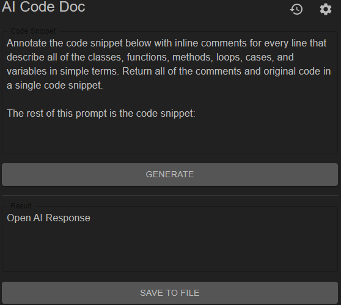

# Prompt Saver Chrome Extension

## Overview

Chrome Extension that saves prompts from selected text or user input. It can also test prompts using openAI's API.

Select the snippet on a web page and click on the extension icon to preview then test or save as you wish. You can optionally save to a local .md for record keeping as well.

Prompt Saver uses the OpenAI GPT-3.5 "chat" API with your own API key ("Bring your own key"). This is currently the most cost-effective API endpoint, but you may want GPT-4 (or later in the future) for more functional use cases.



## Installation

Install [npm](https://nodejs.org/en/download/)

Sync this repo locally (Git Bash):

```bash
git clone https://github.com/PeterPCW/promptSaver
```

Build locally (cmd, don't use npm inside of Git Bash):

```cmd
pnpm build
# or
npm run build
```

Then, in Chrome, go to `chrome://extensions` and click "Load unpacked" and select the `build/chrome-mv3-prod` directory.

## Setup

1. Create an account at [OpenAI](https://beta.openai.com/).
2. Copy your OpenAI API key and paste it in the extension options page.

## Usage

1. Select some code on a webpage (this is optional, you can also just type in the Code Snippet text box).
2. Open the extension popup (click the extension icon in the toolbar).
3. In the popup, the selected code will be displayed as Code Snippet with a prompt prefix. You can edit this prompt as desired but it should work as-is.
4. Review the code snippet and click "Generate".
5. The extension will runn and return the OpenAI response in Result.
6. Use the Save to File button to launch the file location picker if you want to save the documented code. It will save the text in the Result window and append a "Source:" link to the currently active browswer window.

## Roadmap

Some features I want to include/improve:

* More default prompt options - best of the best saved for you already
* Right-click menu on the selected text instead of clicking to the extension icon at the top (although it is easy to hot-key)
* One-click paste to test input field when on ChatGPT, Bard, Poe, Pi, etc.
* Grow window or scroll to bottom always - Save to File button hides when Response is large
* Options page as a modal instead of a new window
* Better CSS, possibly multiple styles (if releasing)
